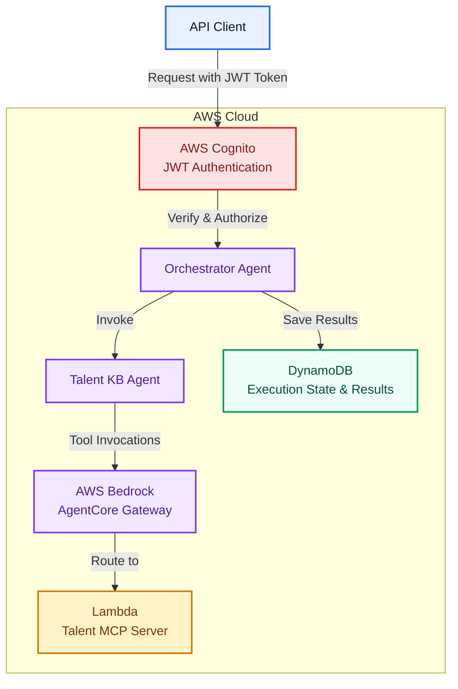

# agent-runtime

AWS Bedrock AgentCore Runtime based Agentic AI service built with Strands. Executes asynchronous agent workflows, orchestrates MCP tools, persists execution state in DynamoDB, and exposes REST APIs for job submission and result retrieval.

## Architecture

The runtime service provides asynchronous agent workflow execution with a multi-agent system architecture:

### Key Components

- **AWS Cognito JWT Authentication**: Validates and authorizes API requests before allowing access to the orchestrator agent
- **Orchestrator Agent**: Top-level agent that coordinates the workflow and invokes specialized agents
- **Talent KB Agent**: Specialized agent that handles talent-related queries and tool invocations
- **AWS Bedrock AgentCore Gateway**: Routes MCP tool invocations from agents to external servers
- **Lambda Talent MCP Server**: AWS Lambda-based MCP server providing talent-related tools and capabilities
- **DynamoDB**: Persists execution state and workflow results

The service supports:
- Secure JWT-based authentication via AWS Cognito for all API requests
- Multi-agent workflow execution with orchestrator agent delegating to specialized agents
- Asynchronous agent workflow execution via authenticated Orchestrator Agent invocation
- MCP tool orchestration through AWS Bedrock AgentCore Gateway
- Integration with specialized agents for domain-specific tasks (e.g., Talent KB Agent)
- Persistent execution state and result storage in DynamoDB
